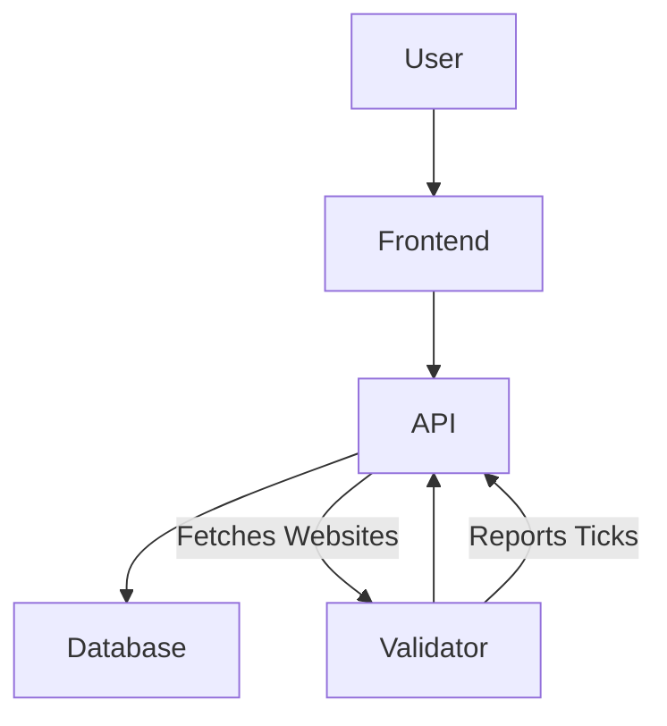

# dpin-uptime Project Documentation

## Introduction
This document provides a comprehensive overview of the `dpin-uptime` project, detailing its architecture, data flow, and key components.

## High-Level Architecture

The `dpin-uptime` project is structured as a monorepo, comprising several interconnected applications and packages. The core components include a user-facing frontend, a backend API, dedicated validator services, and a centralized database.

### Architecture Explanation
*   **User**: Interacts with the system through the Frontend.
*   **Frontend**: The web application that provides the user interface for managing websites and viewing uptime data.
*   **API**: The central backend service that handles all business logic, data persistence, and communication with validators.
*   **Database**: Stores all persistent data, including user information, website configurations, and uptime tick data.
*   **Validator**: Independent services responsible for performing actual uptime checks on registered websites and reporting the results back to the API.

## Data Flow

### 1. Adding a Website
1.  **User Action**: A user adds a new website to monitor via the Frontend.
2.  **Frontend to API**: The Frontend sends a request to the API to register the new website.
3.  **API to Database**: The API validates the request and stores the website's details in the Database.

### 2. Uptime Check Process
1.  **Validator Request**: Validators periodically request a list of websites to monitor from the API.
2.  **API Response**: The API provides the Validator with a list of websites.
3.  **Uptime Check**: The Validator performs an uptime check on each assigned website (e.g., by sending HTTP requests and measuring latency).
4.  **Validator Report**: The Validator reports the results (status, latency) back to the API as a "WebsiteTick".
5.  **API to Database**: The API receives the WebsiteTick and stores it in the Database.

### 3. Data Retrieval and Display
1.  **User Request**: A user requests to view uptime data for their websites via the Frontend.
2.  **Frontend to API**: The Frontend sends a request to the API to retrieve the relevant uptime data.
3.  **API to Database**: The API queries the Database for the requested information.
4.  **Database to API**: The Database returns the uptime data to the API.
5.  **API to Frontend**: The API sends the data back to the Frontend.
6.  **Frontend Display**: The Frontend renders the uptime data for the user.

## Component Deep Dive

### `apps/frontend`
*   **Technology**: Next.js, React, TypeScript.
*   **Purpose**: Provides the graphical user interface for users to interact with the `dpin-uptime` service. This includes features like adding/managing websites, viewing uptime dashboards, and user authentication.
*   **Key Files**: `app/page.tsx`, `app/dashboard/page.tsx`, `components/`, `hooks/`.

### `apps/api`
*   **Technology**: Node.js, Express.js, TypeScript.
*   **Purpose**: Serves as the backend for the entire system. It exposes RESTful APIs for the Frontend and Validators. It handles user authentication (using JWT), website management, and processing of uptime reports from Validators.
*   **Key Files**: `index.ts`, `middleware.ts`, `config.ts`.
*   **Solana Integration**: The presence of `@solana/web3.js` suggests potential integration with the Solana blockchain. This could be used for decentralized aspects such as recording immutable uptime data on-chain, managing validator stakes, or facilitating payouts to validators.

### `apps/validator`
*   **Technology**: Node.js, TypeScript.
*   **Purpose**: These are independent services that perform the actual uptime checks. They communicate with the `api` to get a list of websites to monitor and report the results back. This distributed nature is key to the "decentralized" aspect of the project.
*   **Key Files**: `index.ts`.

### `packages/db`
*   **Technology**: Prisma ORM, PostgreSQL.
*   **Purpose**: Manages all database interactions. It defines the database schema using Prisma, handles migrations, and provides a type-safe client for interacting with the PostgreSQL database.
*   **Key Files**: `prisma/schema.prisma`, `src/index.ts`.
*   **Schema Details**:
    *   `User`: Stores user information.
    *   `Website`: Stores details of websites being monitored.
    *   `Validator`: Stores information about the uptime validators.
    *   `WebsiteTick`: Records the result of each uptime check (status, latency, timestamp).
    *   `Payout`: Manages payouts to validators, potentially linked to Solana integration.

### `packages/ui`
*   **Technology**: React, TypeScript.
*   **Purpose**: A shared library of reusable UI components. This ensures consistency in design and functionality across different frontend applications within the monorepo.
*   **Key Files**: `src/button.tsx`, `src/card.tsx`, `src/code.tsx`.

## Key Concepts

*   **WebsiteTick**: A single record of an uptime check for a specific website by a specific validator at a given time, including its status (Good/Bad) and latency.
*   **Validator**: An entity (likely a running instance of the `apps/validator` service) that performs uptime checks and reports them to the system.
*   **Decentralization**: While the current architecture shows a centralized API and database, the presence of multiple independent `Validator` services and potential Solana integration suggests a move towards a more decentralized model where uptime checks are distributed and potentially verifiable on a blockchain.
